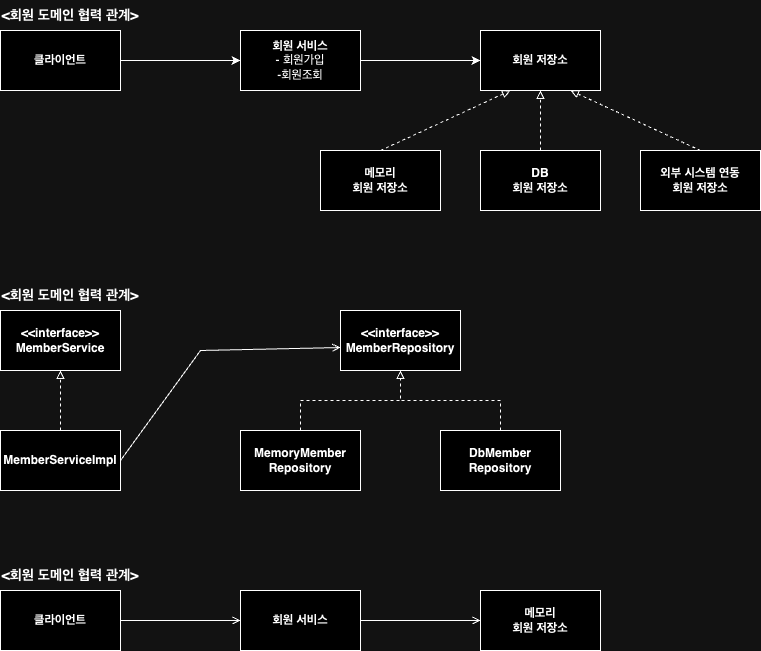
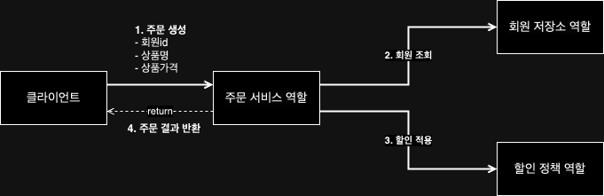

# 소개
인프런 김영환의 스프링 핵심 원리 - 기본편 강의를 들으며 코드 정리하는 공간

# 비즈니스 요구사항과 설계
- 회원
  - 회원가입과 조회할 수 있다.
  - 회원은 일반, VIP 두 가지 등급이 잇다.
  - 회원 데이터는 자체 DB를 구축할 수 있고, 외부 시스템과 연동할 수 있다.(미확정)
- 주문과 할인 정책
  - 회원은 상품 주문할 수 있다.
  - 회원 등급에 따라 할인 정책을 적용할 수 있다.
  - 모든 VIP는 1000원을 할인해주는 고정 금액 할인을 적용. (나중에 변경 가능.)
  - 할인 정책은 변경 가능성이 높다. 회사의 기본 할인 정책을 아직 정하지 못했고, 오픈 직전까지 고민을 미루고 싶다. 최악의 경우 할인을 적용하지 않을 수 있다.

요구사항을 보면 회원 데이터, 할인 정책 같은 부분은 지금 결정하기 어려운 부분이다. 그렇다고 이런 정책이 결정될 때 까지 개발ㅇ르 무기한 기다릴 수 없다. 객체 지향 설계 방법을 통해 해결할 것이다.
인터페이스를 만들고 구현체를 언제든지 갈아끼울 수 있도록 설계할 것이다.

## 회원 도메인 설계의 문제점
- 이 코드의 설계상 문제점은 무엇일까?
- 다른 저장소로 변경할 때 OCP 원칙을 잘 준수할 수 있을까?
- DIP를 잘 지키고 있는가?
- 의존관계가 인터페이스 뿐만 아니라 구현까지 모두 의존하는 문제점이 있다.
  - -> 주문까지 만들고 나서 문제점과 해결 방안을 설명

## 주문 도메인 협력, 역할, 책임

1. **주문 생성:** 클라이언트는 주문 서비스에 주문 생성을 요청한다.
2. **회원 조회:** 할인을 위해서는 회원 등급이 필요하다. 그래서 주문 서비스는 회원 저장소에서 회원을 조회한다.
3. **할인 적용:** 주문 서비스는 회원 등ㄱ브에 따른 할인 여부를 할인 정책에 위임한다.
4. **주문 결과 반환:** 주문 서비스는 할인 결과를 포함한 주문 결과를 반환한다.

## 새로운 할인 정책 개발
**새로운 할인 정책을 확장**
- 기획자: 서비스 오픈 직전에 할인 정책을 지금처럼 고정 금액 할인이 아니라 좀 더 합리적인 주문 금액당 할인하는 정률% 할인으로 변경하고 싶어요. 예를 들어 기존 정책은 VIP가 10,000원을 주문하든 20,000원을 주문하든 항상 1,000원을 할인 했는데, 이번에 새로 나온 정책은 10%로 지정하고 싶습니다.

## 관심사의 분리
**로미오와 줄리엣으로 비유해보자.**
- 배우는 본인의 역할인 배역을 수행하는 것에만 집중해야 한다.
- 어떤 배우가 선택되더라도 똑같이 공연 할 수 있어야 한다.
- 공연을 구성하고, 담당 배우를 섭외하고, 역할에 맞는 배우를 지정하는 책임을 담당하는 별도의 '공연 기획자'가 나올 시점이다.
- 공연 기획자를 만들고, 배우와 공연 기획자의 책임을 확실히 분리하자.

## DIP에 적합한 코드
**AppConfig 클래스를 통해 구성영역(AppConfig), 사용영역(나머지)로 나누었다.**
- 관심사 분리의 큰 장점은 **구성 영역**만 수정하고 **사용 영역**은 수정하지 않아도 된다는 점이다.

## 좋은 객체 지향 설계의 5가지 원칙 적용
*여기서 3가지 SRP, DIP, OCP 적기*

### SRP 단일 책임 원칙
**한 클래스는 하나의 책임만 가져야 한다.**
- 클라이언트 객체는 직접 구현 객체를 생성하고, 연결하고, 실행하는 다양한 책임을 가지고 있음
- SRP 단일 책임 원칙을 따르면서 관심사를 분리함
- 구현 객체를 생성하고 연결하는 책임은 AppConfig가 담당
- 클라이언트 객체는 실행하는 책임만 담당

### DIP 의존관계 역전 원칙
**프로그래머는 "추상화에 의존해야지, 구체화에 의존하면 안된다." 의존성 주입은 이 원칙을 따르는 방법 중 하나다.**
- 새로운 할인 정책을 개발하고, 적용하려고 하니 클라이언트 코드도 함께 변경해야 했다. 왜냐하면 기존 클라이언트 코드는 DIP를 지키며 추상화 인터페이스에 의존하는 것 같았지만, 구체화 구현 클래스에도 함께 의존했다.
- 클라이언트 코드가 추상화 인터페이스에만 의존하도록 코드를 변경했다.
- 하지만 클라이언트 코드는 인터페이스만으로는 아무것도 실행할 수 없다.
- AppConfig가 객체 인스턴스를 클라이언트 코드 대신 생성해서 클라이언트 코드에 의존관계를 주입했다. 이렇게해서 DIP 원칙을 따르면서 문제도 해결했다.

### OCP
**소프트웨어 요소는 확장에 열려있으나 변경에는 닫혀 있어야 한다.**
- 다형성을 사용하고 클라이언트가 DIP를 지킴
- 애플리케이션을 사용 영역과 구성 영역으로 나눔
- AppConfig가 의존관계를 클라이언트 코드에 주입하므로 클라이언트 코드는 변경하지 않아도 된다.
- **소프트웨어 요소를 새롭게 확장해도 사용 역역의 변경은 닫혀 있다.**

